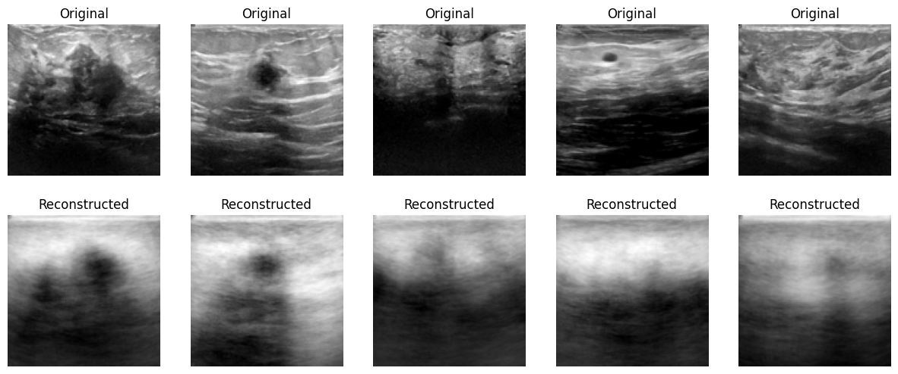
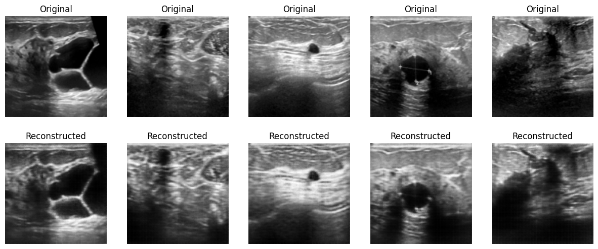

# Autoencoder-based Models for Breast Cancer Detection

This repository explores the use of autoencoders for breast cancer detection using ultrasound image data.

## Data

The data used in this study is the Breast Ultrasound Images dataset from Kaggle: [Link to dataset on Kaggle](https://www.kaggle.com/datasets/aryashah2k/breast-ultrasound-images-dataset/).

## Autoencoder Models

Three different autoencoder models are implemented:

1. **Linear Autoencoder:** A basic autoencoder with Tanh activation functions and dense layers as encoder and decoder.

   

2. **Convolutional Autoencoder (CNN Autoencoder):** A convolutional autoencoder that utilizes convolutional and pooling layers to extract features from the image data.

   

**Feel free to use the notebook and contribute to the project!**

I encourage you to explore the code, make modifications, and share your findings.
